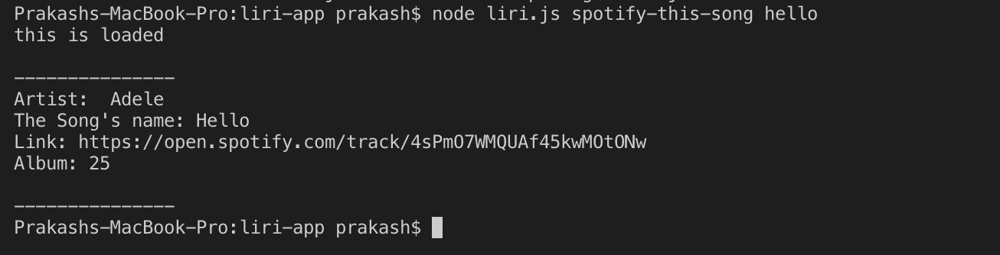
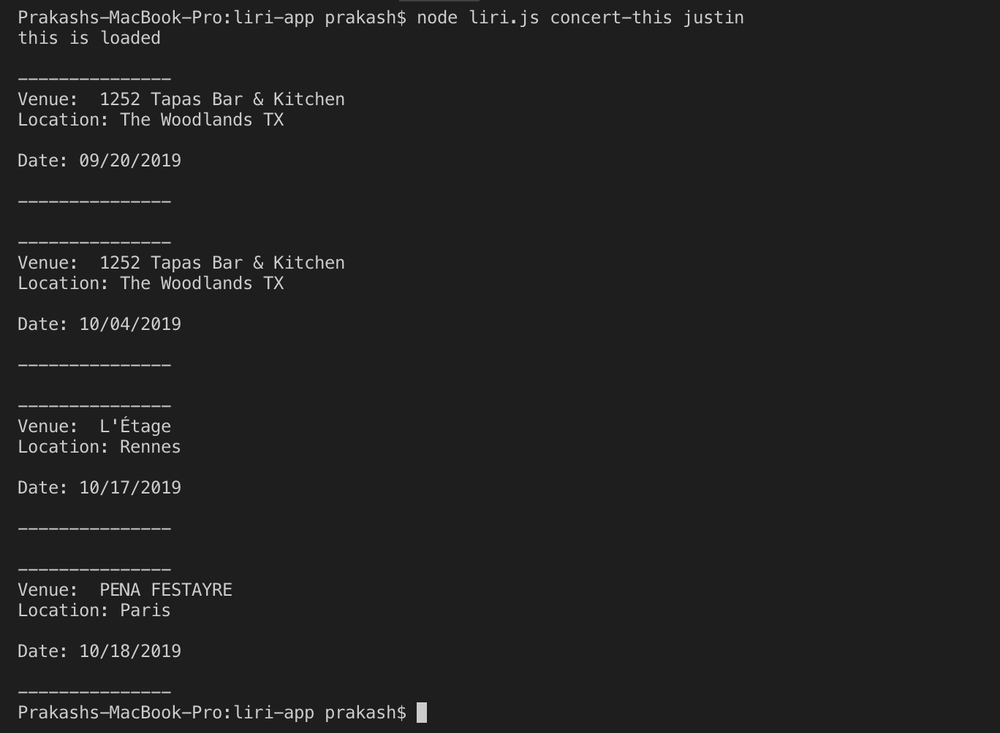
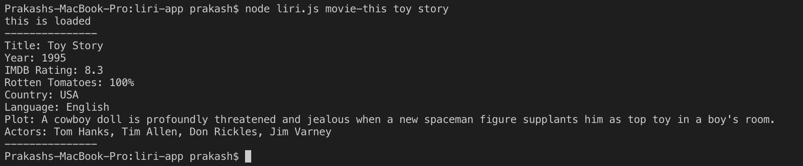
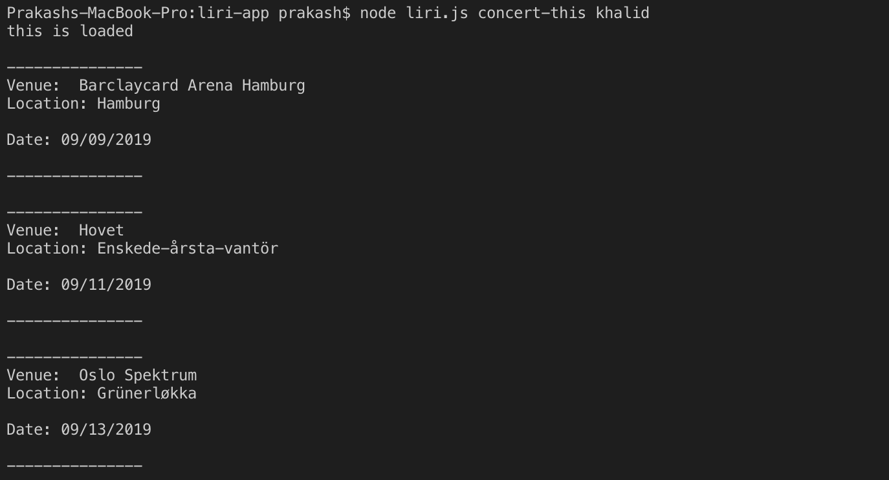

# liri-node-app

<h2>About</h2>

Creating a command prompt based bot that takes in commands and provides output from spotify, bands in town, or omdb.

<h2>Instruction</h2>

Use the following commands input: 

<ul>
    <li> spotify-this-song [song-name]
        <ul>
            <li>provide a list of songs form Spotify including song name, author(s), URL and track name</li>
        </ul>
    </li>
    <li> movie-this [movie-name]
        <ul>
            <li>Provides details of a specific movie from IMDB including title, release year, rating, country, language, plot and actors. </li>
        </ul>
    </li>
    <li> concert-this [artist-name]
        <ul>
            <li>Provides all the list of the upcomming concerts of the named artist with venue, location and date. </li>
        </ul>
    </li>
</ul>

<h2>Built with</h2>
<ul>
<li>JavaScript - programming language</li>
<li>Node.js - programming language</li>
<li>NPM - File System - A node package for reading and writing to files.</li>
<li>NPM - Request - A node package for retriving data from specific URLs.</li>
<li>NPM - NODE-Spotify-API - A node package for retriving datat form Spotify</li>
<li>NPM - Dotenv - A node package to help store sensative information</li>
<li>NPM - Axios - A node package for making request</li>
</ul>

<h2>Screenshot</h2>

     

     

     

     

     

<a href="https://www.youtube.com/watch?v=TgXX6VjXqy4">take a look</a>